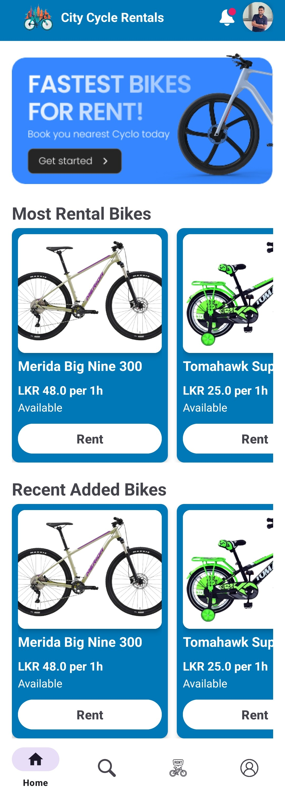
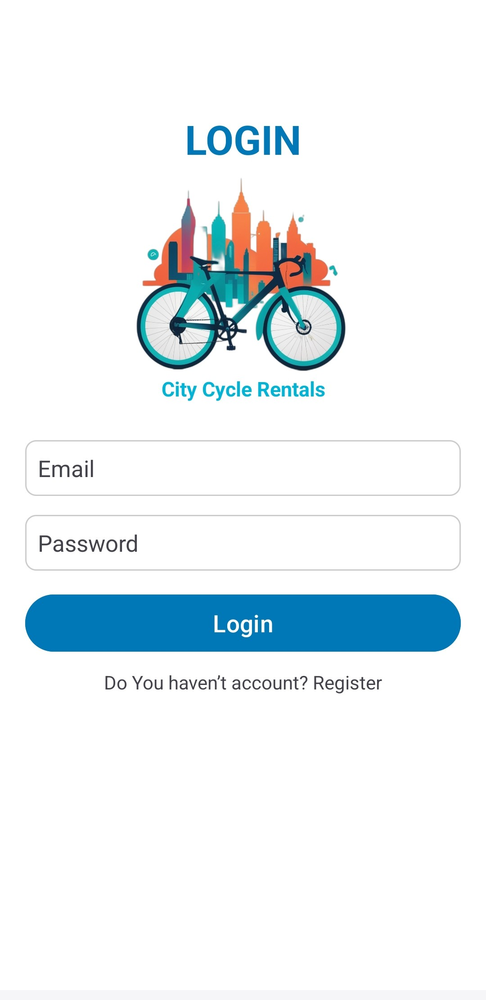
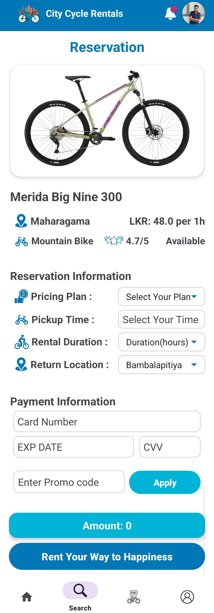
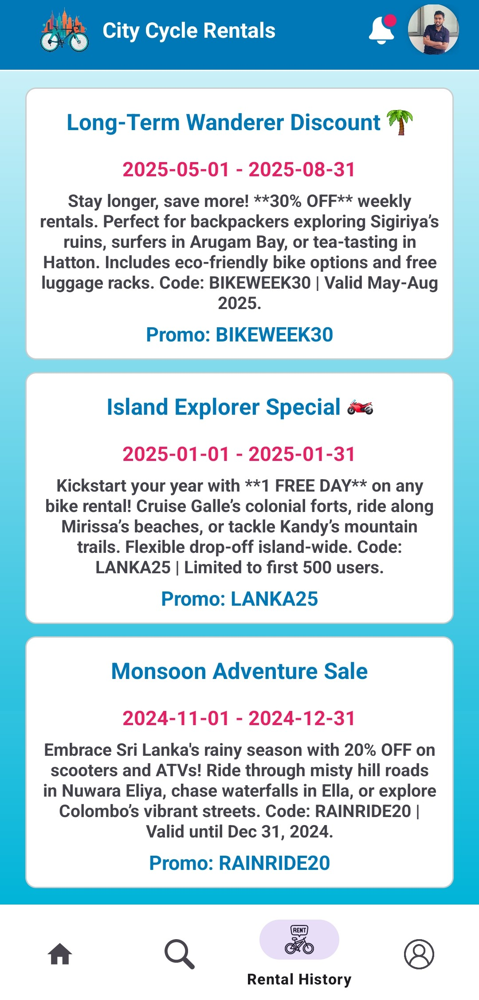
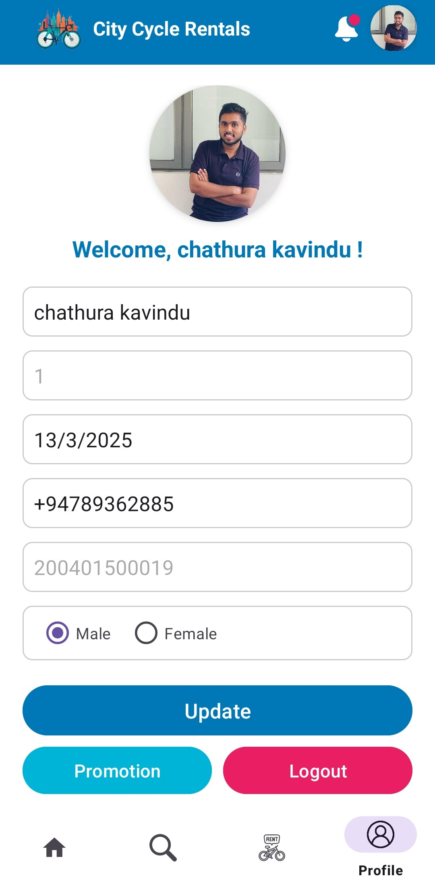

# City Cycle Rentals Android App 🚴♂️

[](https://github.com/chathurak15/City-Cycle-Rentals-Android-App)
[](https://www.android.com/)

An Android app for renting bicycles across Sri Lanka, offering seamless booking, promo code integration, and user profile management.

---

## 📱 Features
- **User Authentication**: Register, login, and manage profiles with NIC, contact details, and gender.
- **Bike Search & Reservation**: Filter bikes by location, price, and type. Reserve bikes with flexible pickup/drop-off times.
- **Promotions**: Apply promo codes (e.g., `BIKEWEEK30`, `LANKA25`) for discounts and special offers.
- **Rental History**: Track past rentals with details like pickup/return times and locations.
- **Payment Integration**: Secure card payment processing for reservations.
- **Profile Customization**: Update personal details and gender preferences.

---

## 🛠 Technologies Used
- **Frontend**: `XML` for UI layouts.
- **Backend**: `Java` for business logic.
- **Database**: `SQLite` for local data storage (user profiles, rentals).
- **Tools**: Android Studio, Git.

---

## Demo Video 🎥
[

---

## 🎨 Wireframe  
View the Figma wireframe and prototype for this app:  
[](https://www.figma.com/design/u6HsML5CRZuv2XobxZPa5N/Bike-Rental?node-id=0-1&t=v1pwpeMOWQ1MpwFa-1)  

## 📸 Screenshots
| Home Screen | Login | Reservation |
|-------------|-------|-------------|
|  |  |  |

| Promotion | Profile | Rental History |
|-----------|---------|----------------|
|  |  |  |

---

## 🚀 Installation
1. Clone the repository:
   ```bash
   git clone https://github.com/chathurak15/City-Cycle-Rentals-Android-App.git
